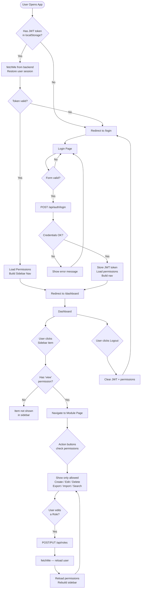
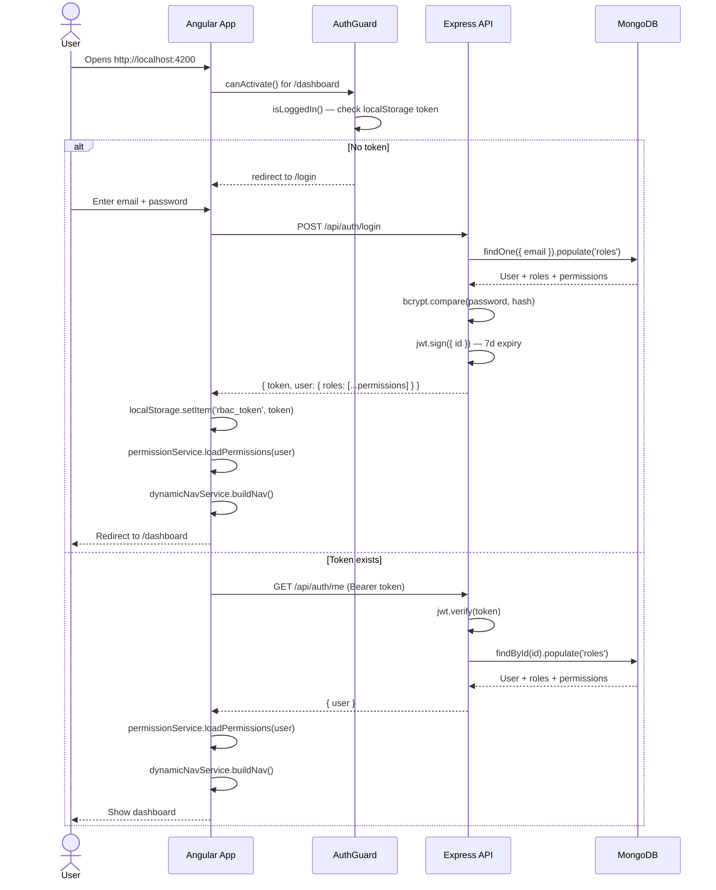
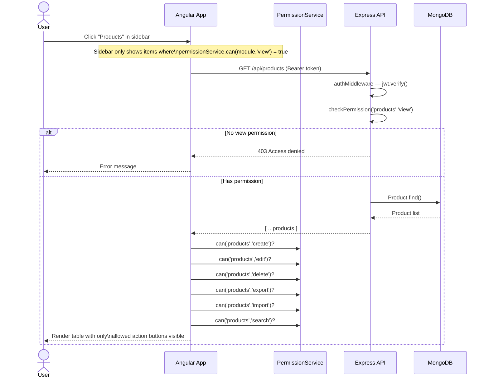
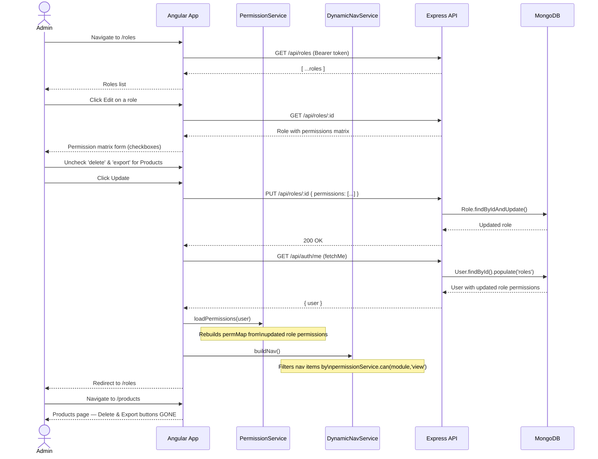

# RBAC Admin — Application Documentation

## Overview

RBAC Admin is a full-stack **Role-Based Access Control** (RBAC) management system. It allows administrators to define roles with granular per-module permissions and assign those roles to users. All UI elements (buttons, actions, sidebar navigation) are dynamically shown or hidden based on the logged-in user's effective permissions.

---

## Tech Stack

| Layer | Technology |
|---|---|
| Frontend | Angular 16, Angular Material, TypeScript |
| Backend | Node.js, Express.js |
| Database | MongoDB (Mongoose ODM) |
| Auth | JWT (JSON Web Tokens) — 7-day expiry |
| Dev Tools | ng serve (port 4200), nodemon (port 5000) |

---

## Application Modules

| Module | Route | Description |
|---|---|---|
| Dashboard | `/dashboard` | Landing page after login |
| Users | `/users` | CRUD for application users |
| Roles | `/roles` | CRUD for roles + permission matrix |
| Products | `/products` | Product catalogue with RBAC-guarded actions |
| Orders | `/orders` | Order list with inline status updates |
| Reports | `/reports` | (Reserved — future use) |
| Settings | `/settings` | (Reserved — future use) |

---

## Permission Model

Each role has a **permission matrix**: one row per module, seven boolean columns.

| Action | Description |
|---|---|
| `view` | Can see the module in the sidebar and access the page |
| `create` | Can add new records (Add button visible) |
| `edit` | Can modify records (Edit button / status dropdown visible) |
| `delete` | Can remove records (Delete button visible) |
| `export` | Can download data as CSV (Export button visible) |
| `import` | Can upload data via CSV (Import button visible) |
| `search` | Can use the search bar (Search button visible) |

Permissions from multiple roles are **merged using union** — if any role grants access, it is granted.

---

## User Flow



---

## Sequence Diagram — Login & Permission Load



---

## Sequence Diagram — RBAC Permission Check (Products Page)



---

## Sequence Diagram — Edit Role & Live Permission Refresh



---

## Architecture Overview

```mermaid
flowchart LR
    subgraph Frontend["Angular 16 Frontend (port 4200)"]
        direction TB
        AppComp[AppComponent\nSidenav Layout]
        AuthG[AuthGuard\nJWT check]
        PermG[PermissionGuard\nmodule+action check]
        PermS[PermissionService\nIn-memory permMap]
        NavS[DynamicNavService\nFiltered nav items]
        AuthS[AuthService\nJWT storage + currentUser$]
        Interceptor[AuthInterceptor\nInjects Bearer token]

        subgraph Pages
            Login
            Dashboard
            Users
            Roles
            Products
            Orders
        end

        AppComp --> AuthG
        AppComp --> PermS
        AppComp --> NavS
        AuthG --> AuthS
        PermG --> PermS
        Pages --> PermS
        Interceptor --> AuthS
    end

    subgraph Backend["Express API (port 5000)"]
        direction TB
        AuthMW[authMiddleware\njwt.verify]
        PermMW[checkPermission\nUnion merge across roles]
        AuthCtrl[/api/auth]
        RoleCtrl[/api/roles]
        UserCtrl[/api/users]
        ProdCtrl[/api/products]
        OrdCtrl[/api/orders]
    end

    subgraph DB["MongoDB (port 27017)"]
        Users[(Users)]
        RolesDB[(Roles)]
        Products[(Products)]
        Orders[(Orders)]
    end

    Frontend -- "HTTP + Bearer JWT" --> Backend
    Backend --> DB
```

---

## Default Seed Data

### Users

| Name | Email | Password | Role |
|---|---|---|---|
| Admin | `admin@rbac.com` | `Admin@123` | Admin (full access) |
| User | `user@rbac.com` | `User@123` | Viewer (view-only) |

### Roles

| Role | Permissions |
|---|---|
| **Admin** | All 7 actions (`view`, `create`, `edit`, `delete`, `export`, `import`, `search`) on all 7 modules |
| **Viewer** | `view` only on all 7 modules |

### Sample Products
10 products across Electronics, Furniture, Accessories, and Stationery categories (SKU-001 to SKU-010).

### Sample Orders
7 orders with statuses: `pending`, `processing`, `shipped`, `delivered`, `cancelled`.

---

## Running the Application

```bash
# 1. Start MongoDB
sudo systemctl start mongod

# 2. Start Backend (from sample-repo-workshop/backend/)
node server.js
# → Server running on port 5000

# 3. Start Frontend (from sample-repo-workshop/frontend/)
ng serve --port 4200
# → Angular Live Development Server is listening on localhost:4200

# 4. Open browser
http://localhost:4200
```

Or from the monorepo root (`sample-repo-workshop/`):
```bash
npm run dev   # starts both concurrently
```

---

## API Reference

### Auth
| Method | Endpoint | Description | Auth |
|---|---|---|---|
| POST | `/api/auth/register` | Register new user | None |
| POST | `/api/auth/login` | Login, returns JWT | None |
| GET | `/api/auth/me` | Get current user (with roles) | JWT |

### Roles
| Method | Endpoint | Permission Needed |
|---|---|---|
| GET | `/api/roles` | `roles.view` |
| GET | `/api/roles/:id` | `roles.view` |
| POST | `/api/roles` | `roles.create` |
| PUT | `/api/roles/:id` | `roles.edit` |
| DELETE | `/api/roles/:id` | `roles.delete` |

### Users
| Method | Endpoint | Permission Needed |
|---|---|---|
| GET | `/api/users` | `users.view` |
| POST | `/api/users` | `users.create` |
| PUT | `/api/users/:id` | `users.edit` |
| DELETE | `/api/users/:id` | `users.delete` |

### Products
| Method | Endpoint | Permission Needed |
|---|---|---|
| GET | `/api/products` | `products.view` |
| POST | `/api/products` | `products.create` |
| PUT | `/api/products/:id` | `products.edit` |
| DELETE | `/api/products/:id` | `products.delete` |

### Orders
| Method | Endpoint | Permission Needed |
|---|---|---|
| GET | `/api/orders` | `orders.view` |
| POST | `/api/orders` | `orders.create` |
| PUT | `/api/orders/:id` | `orders.edit` |
| DELETE | `/api/orders/:id` | `orders.delete` |
